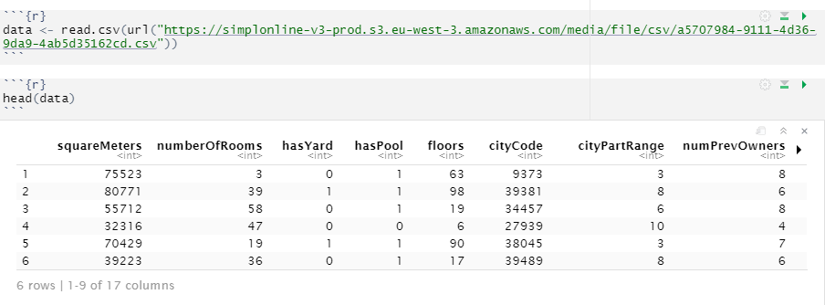
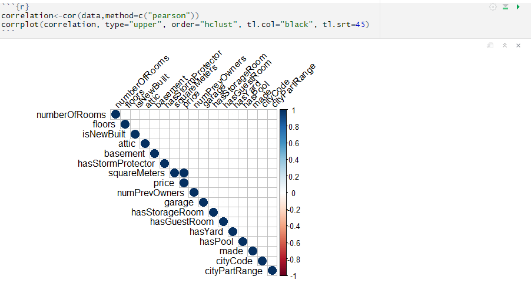
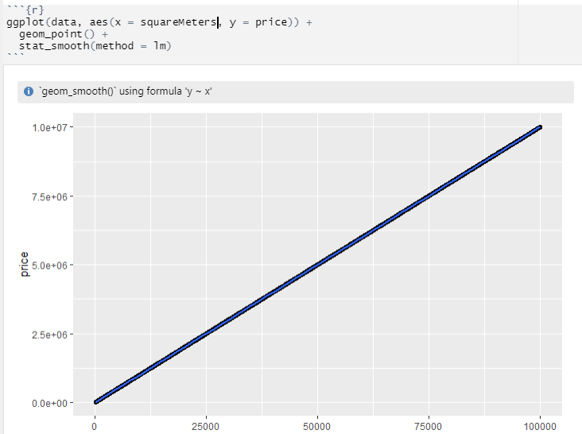
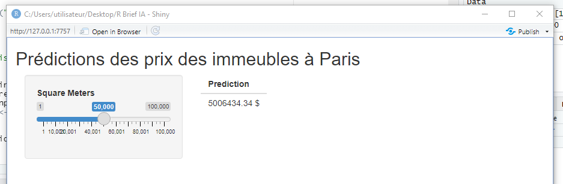

# R for AI
## Introduction

R est un langage de programmation est destiné aux statistiques et à la science des données : il est très utilisé par les statisticiens, les data miners et les data scientists. Il est très efficace pour analyser et manipuler des données dans une démarche statistique.

R possède également un important et très grand référentiel de packages organisés appelé CRAN. CRAN est un référentiel centralisé et bien entretenu de tous les packages disponibles pour le langage R, et comprend de nombreux packages très puissants et utiles applicables à un grand nombre de tâches.

Connu essentiellement dans les travaux de statistiques, R peut aussi être utilisé dans la réalisation de modèles d'intelligence artificielle dans le cadre du Machine Learning.

## Téléchargement d'un dataset

Nous nous proposons de travailler sur un fichier CSV téléchargé directement sur Simplon. Après lecture, nous pouvons afficher un résumé de ce dataset :

  

Plusieurs variables sont présents on y trouve notamment :

* squareMeters
* numberOfRooms
* hasYard
* hasPool
* floors - number of floors
* cityCode - zip code
* cityPartRange - the higher the range, the more exclusive the neighbourhood is
* numPrevOwners - number of prevoious owners
* made - year
* isNewBuilt
* hasStormProtector
* basement - basement square meters
* attic - attic square meteres
* garage - garage size
* hasStorageRoom
* hasGuestRoom - number of guest rooms
* price - predicted value

## Analyses des variables

Une matrice de corrélation peut être réalisé pour observer les variables qui s'influent entre-elles en utilisant la méthode de Pearson:

  

Nous remarquons que les variables *price* et *SpaceMeters* se corrèlent à 1 (corr = 0,9999..). Les autres ne se corrèlent pas présentant un score de 0. Nous sommes donc confronter à un problème de régression. De plus, nous observons que celle-ci est une régression linéaire comme le suggère le graphique ci-dessous :

  

## Création du modèle

Notre modèle est généré simplement en entrant le code suivant :

`model<-lm(price ~ squareMeters, data=data)
model`

Il est ensuite sauvegardé pour son utilisation dans Shiny, un package proposant de construire des interfaces graphiques simples et rapides.

## Interface Shiny

Un template de base est généré en ouvrant le fichier app.R. Notre modèle est chargé dans ce dernier permettant ensuite d'émettre des prédictions de prix en fonction de la surface que nous choisissons en déplaçant un curseur.

  

## Conclusion

  

